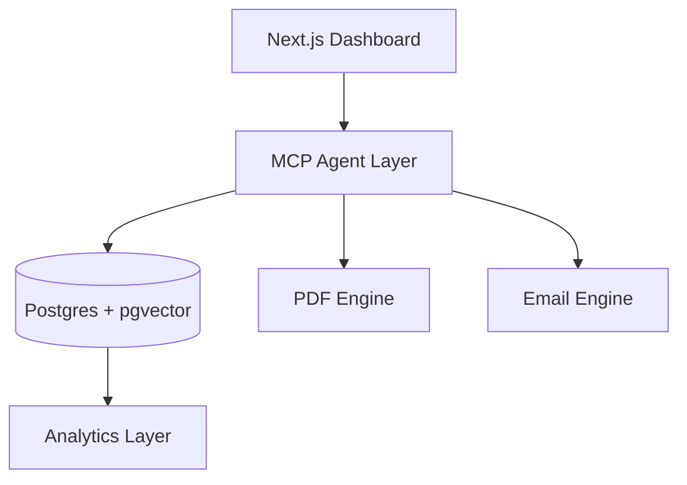
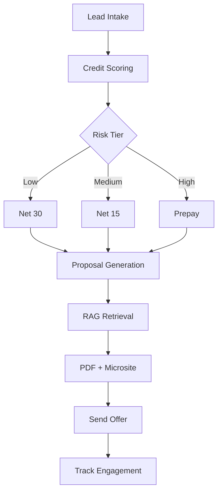
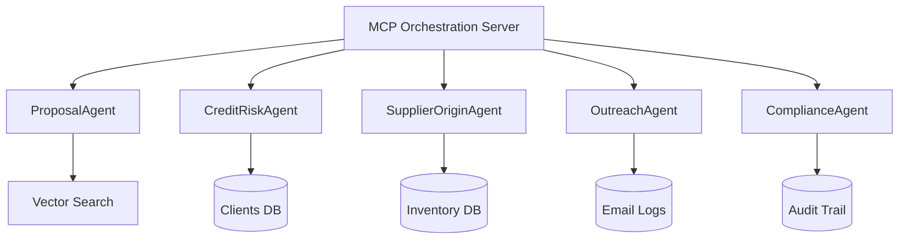
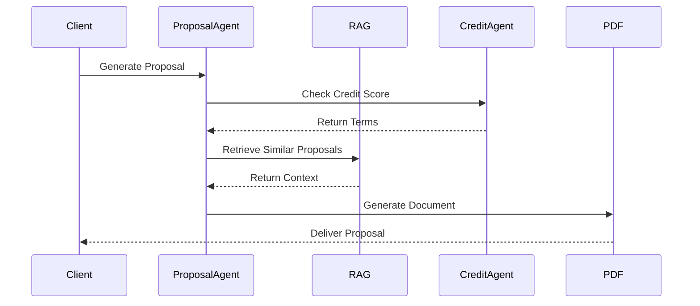
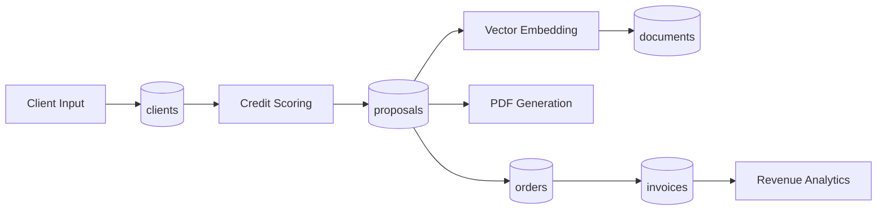
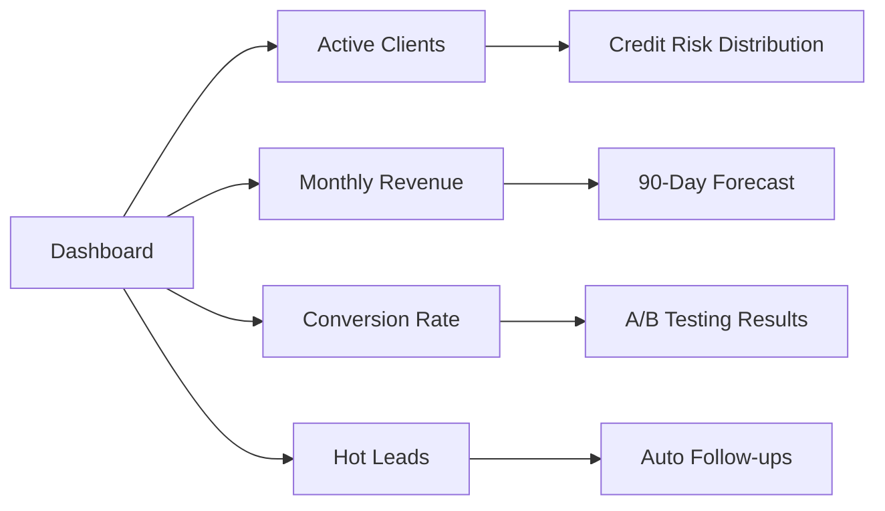
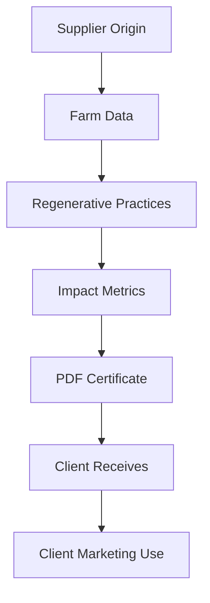
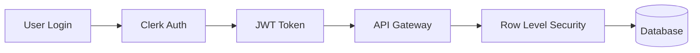
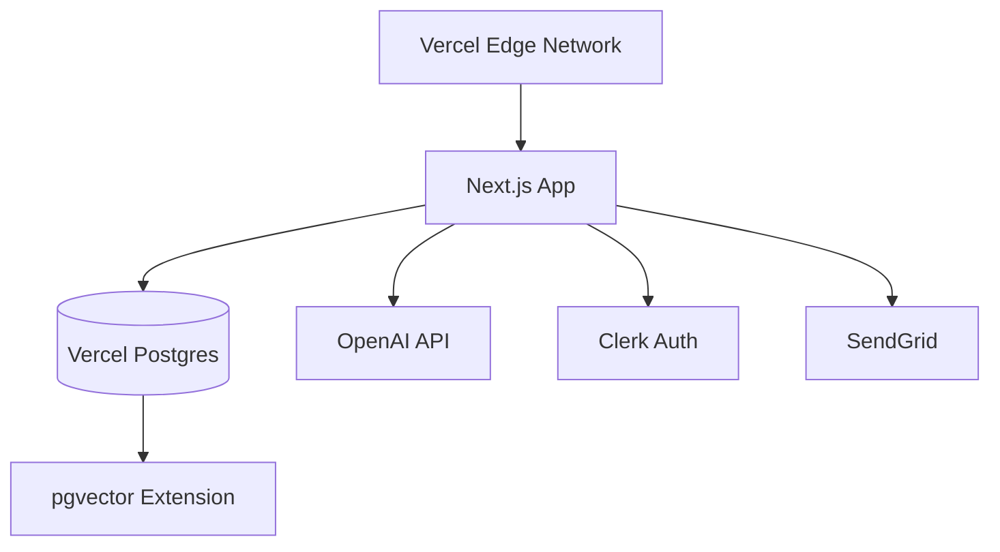

# 🌍 FTHTrading Boutique OS

## 50 Years of Global Commodity Intelligence. Now AI-Native.

> *Five decades structuring transactions in coffee, precious metals, agricultural commodities, and raw materials — modernized through institutional-grade AI infrastructure.*

**Est. 1976** | Coffee • Gold • Sugar • Cocoa • Base Metals • Energy

---

# 🧭 Table of Contents

| Section                 | Category            | Layer            |
|:------------------------|:--------------------|:-----------------|
| [🏛 Heritage & Mission](#-heritage--mission) | Company Overview | 🟪 Intelligence |
| [🧠 What This Is](#-what-this-is) | System Overview | 🟪 Intelligence |
| [🌍 Commodity Portfolio](#-commodity-portfolio) | Global Offerings | 🟩 Revenue |
| [🏗 Architecture](#-architecture) | Technical Blueprint | ⚫ Infrastructure |
| [🚀 Quick Start](#-quick-start) | Deployment | 🟦 Interface |
| [📦 Core Modules](#-core-modules) | Revenue Engine | 🟩 Revenue |
| [🤖 MCP Agents](#-mcp-agent-layer) | Agent Layer | 🟪 Intelligence |
| [🗄 Database Schema](#-database-overview) | Data Layer | ⚫ Infrastructure |
| [📄 PDF Engine](#-proposal-engine) | Offer Generation | 🟩 Revenue |
| [📈 Analytics](#-analytics-dashboard) | Intelligence | 🟨 Risk |
| [🌱 Regenerative](#-regenerative-certificate-layer) | Sourcing Layer | 🟩 Revenue |
| [🔒 Security](#-governance--security) | Governance | 🟥 Governance |
| [🔮 Roadmap](#-roadmap) | Expansion | 🟪 Intelligence |

---

# 🏛 Heritage & Mission

**Founded 1976** in the heart of the commodity trading corridor, FTHTrading has structured transactions across five continents for half a century.

**Core Expertise:**
- ☕ **Coffee & Agricultural Commodities** — Regenerative sourcing, micro-lot specialization since 1976
- 🥇 **Precious Metals** — LBMA-certified custody, allocated storage partnerships
- 🏭 **Base Metals & Industrial Materials** — LME integration, hedging strategies
- ⚡ **Energy Products** — Forward contracts, terminal logistics

**Philosophy:** Legacy relationships, modern infrastructure. We combine 50 years of institutional knowledge with AI-native intelligence to deliver high-end commodity advisory services that boutique traders and institutional buyers trust.

Coffee remains our flagship specialty — the doorway through which most clients discover our broader capabilities.

---

# 🧠 What This Is

A complete **MCP-orchestrated, RAG-powered** global commodity advisory system that automates:

* Multi-commodity lead qualification & credit scoring
* Custom proposal generation (PDF + Web + Email)
* Cross-commodity inventory forecasting & supplier tracking
* Terms management & invoice aging
* Automated follow-ups & reorder prediction
* Regenerative sourcing certificates (agricultural)
* LBMA custody tracking (precious metals)
* Trade compliance screening (OFAC/AML/export controls)
* Full analytics & CRM dashboard

**Positioned:** Boutique advisory service  
**Built:** Like institutional infrastructure  
**Proven:** 50 years of commodity distribution

---

# 🌍 Commodity Portfolio

## Flagship: Coffee & Agricultural Products ☕

**Status:** Fully operational AI infrastructure  
**Since:** 1976  
**Specialization:** Regenerative sourcing, micro-lot traceability

Coffee is our hero product — the doorway through which institutional buyers, retail chains, and boutique cafes discover our capabilities.

| Product | Origins | Certifications | Typical Volume |
|:--------|:--------|:---------------|:---------------|
| Specialty Coffee | Brazil, Colombia, Ethiopia | Organic, Fair Trade, Regenerative | 100-10,000 lbs |
| Cocoa | Côte d'Ivoire, Ecuador, Ghana | Fair Trade, Rainforest Alliance | 500-5,000 lbs |
| Sugar | Brazil, India, Thailand | Organic, Non-GMO | Bulk containers |
| Spices | India, Vietnam, Indonesia | Organic, Direct sourcing | Variable |

**What's Automated:**
- Regenerative impact certificates
- ICO pricing intelligence
- Origin documentation
- Quality grading (cupping scores)
- Phytosanitary compliance

---

## Precious Metals 🥇

**Status:** Custody protocols active  
**Since:** 1982  
**Specialization:** LBMA-certified allocated storage

| Metal | Standard | Trading Reference | Custody |
|:------|:---------|:------------------|:--------|
| Gold | .999 Fine | LBMA London Good Delivery | Secured vault network |
| Silver | .999 Fine | LBMA/COMEX | Allocated storage |
| Platinum | .9995 Fine | LPPM | Private vault partnerships |
| Palladium | .9995 Fine | LPPM | Segregated accounts |

**What's Automated:**
- LBMA certification verification
- Assay documentation
- Custody tracking
- Insurance certificate generation
- AML/KYC screening

---

## Base Metals & Raw Materials 🏭

**Status:** Trade compliance layer operational  
**Since:** 1989  
**Specialization:** LME integration, hedging strategies

| Metal | Grade | Exchange | Application |
|:------|:------|:---------|:------------|
| Copper | Grade A Cathode | LME, COMEX | Industrial supply |
| Aluminum | Primary A7 | LME | Manufacturing |
| Nickel | Class 1 | LME | Battery sector |
| Zinc | SHG | LME | Galvanization |

**What's Automated:**
- LME forward pricing
- Quality specifications (ASTM/ISO)
- Export control screening
- Hedging recommendations

---

## Energy Products ⚡

**Status:** Terminal logistics established  
**Since:** 1995  
**Specialization:** Forward contracts, basis trading

| Product | Specification | Trading Hub |
|:--------|:--------------|:------------|
| Crude Oil | WTI, Brent | Cushing, Houston |
| Natural Gas | Henry Hub | US pipeline network |
| Refined Products | ULSD, RBOB | Terminal delivery |

**What's Automated:**
- Futures pricing intelligence
- Transportation logistics
- Certificate of quality generation
- Regulatory compliance (DOE/EPA)

---

## Client Segmentation by Commodity

| Client Type | Focus Commodity | Typical Transaction | Payment Terms |
|:------------|:----------------|:--------------------|:--------------|
| **Retail/Convenience** | Coffee | 100-1,000 lbs | Prepay to Net-30 |
| **Boutique Cafes** | Coffee, specialty products | Micro-lots, 50-500 lbs | Net-15 to Net-30 |
| **Investment Clients** | Precious metals | $50K-$1M transactions | Wire transfer, custody |
| **Industrial Buyers** | Base metals | Container loads, metric tons | Net-30 to Net-60, LC |
| **Trading Firms** | Energy, futures | Contracts, physical delivery | Margin accounts |
| **Food Manufacturers** | Sugar, cocoa, spices | Bulk containers | Net-60, LC |

---

**See [docs/commodity-expansion.md](docs/commodity-expansion.md) for complete multi-commodity architecture, compliance frameworks, and expansion roadmap.**

---

# 🏗 Architecture

## System Overview

| Layer | Module | Purpose | Status |
|:------|:-------|:--------|:-------|
| 🟦 Interface | Dashboard | Account & proposal control | Active |
| 🟩 Revenue | Proposal Engine | Tailored offer generation | Active |
| 🟨 Risk | Credit Scoring | Term structuring logic | Active |
| 🟪 Intelligence | RAG Vault | Memory of past proposals | Active |
| 🟥 Governance | Audit Logging | Offer traceability | Active |
| ⚫ Infrastructure | Cloud Stack | Secure deployment | Ready |

## System Intelligence Graph



## Execution Flowtree



---

## 🚀 Quick Start

### Prerequisites

- Node.js 18+
- PostgreSQL 15+ with pgvector extension
- OpenAI API key
- Clerk account (auth)

### Installation

```bash
# Clone and install
cd coffee-advisory-os
npm install

# Set up environment
cp .env.example .env
# Edit .env with your credentials

# Initialize database
npm run db:push

# Start development servers
npm run dev          # Next.js frontend (port 3000)
npm run mcp:start    # MCP agent server (port 3001)
```

Visit `http://localhost:3000`

---

## 📦 Core Modules

### 🏪 Lead Intake
Capture coffee shop details via QR code or web form:
- Business info
- Credit references
- Volume requirements
- Preferred roast profiles

### 💳 Credit Qualifier
Auto-score creditworthiness:
- Years in business
- Revenue analysis
- Trade references
- Payment history
- **Output**: Net 30 / Net 15 / Prepay

### 📄 Proposal Generator
AI-powered custom proposals:
- Client-specific messaging
- Volume tier pricing
- Payment terms alignment
- Regenerative sourcing details
- Branded PDF + web microsite

### 📊 CRM Dashboard
Real-time intelligence:
- Hot leads (high credit score)
- Risk accounts
- Revenue forecasting
- Inventory depletion
- Invoice aging
- 90-day reorder prediction

### 🌎 Supplier Tracker
Brazil & Colombia regenerative lots:
- Origin traceability
- Sustainability certificates
- Farm impact metrics

---

# 🤖 MCP Agent Layer

## Agent Map



## Agent Intelligence Flow



## Agent Capabilities

### 🎯 ProposalAgent
- Retrieves similar past deals via RAG
- Adapts tone for client type (cafe vs. gas station vs. boutique)
- Adjusts margins dynamically based on volume
- Generates PDF + HTML email + web microsite
- Tracks proposal engagement metrics

**Key Functions:**
- `generateProposal(clientId, params)`
- `regenerateProposal(proposalId, changes)`
- `getProposalMetrics(proposalId)`
- `analyzeConversionRates()`

### 💳 CreditRiskAgent
- Scores financial inputs (110-point scale)
- Flags risk factors automatically
- Suggests appropriate term structure
- Monitors aging invoices (30/60/90 day tracking)
- Auto-downgrades high-risk accounts to prepay

**Scoring Algorithm:**
- Years in business: 0-20 pts
- Monthly revenue: 0-25 pts
- D&B score: 0-30 pts
- Trade references: 0-15 pts
- Payment history: 0-20 pts

**Key Functions:**
- `scoreClient(clientId)`
- `getHighRiskClients()`
- `monitorOverdueInvoices()`
- `flagRiskAccounts()`

### 🌎 SupplierOriginAgent
- Tracks regenerative sourcing lots
- Creates sustainability certificates
- Calculates environmental impact metrics
- Generates farm story narratives
- Monitors low-stock alerts

**Key Functions:**
- `generateCertificate(originId, volume)`
- `getRegenerativeOrigins()`
- `calculateTotalImpact(clientId)`
- `monitorLowStock(threshold)`

### 📧 OutreachAgent
- Drafts AI-personalized emails (4 types: initial, follow-up, proposal, reorder)
- Schedules automated follow-ups
- Tracks response rates
- Identifies stale leads (>30 days no contact)
- Generates reorder reminders

**Key Functions:**
- `draftEmail(clientId, purpose)`
- `scheduleFollowUp(clientId, days, message)`
- `getFollowUpsForToday()`
- `trackResponse(clientId)`

### ✅ ComplianceAgent
- Verifies proposals meet legal requirements
- Ensures payment terms match credit score
- Checks pricing margins (minimum 15%)
- Validates required fields
- Maintains complete audit trail
- Flags high-value deals for manual approval

**Key Functions:**
- `verifyProposal(proposalId)`
- `checkPaymentTerms(clientId, terms)`
- `getAuditTrail(proposalId)`
- `getComplianceSummary()`

---

# 🗄 Database Overview

## Schema Architecture

| Table | Purpose | Key Features |
|:------|:--------|:-------------|
| `clients` | Account profiles & credit scoring | Auto-scoring, term recommendations, contact history |
| `proposals` | Generated offers & versions | RAG sources tracking, engagement metrics, PDF URLs |
| `products` | SKU & roast data | Volume pricing tiers, margin calculations |
| `inventory` | Stock + warehouse | Regenerative lot tracking, depletion alerts |
| `invoices` | Payment tracking | Aging analysis, auto-dunning, credit impact |
| `orders` | Fulfillment pipeline | Status tracking, margin actuals |
| `documents` | RAG embeddings | 1536-dimension vectors, semantic search |
| `agent_logs` | Complete audit trail | All agent actions, context, decisions |
| `supplier_origins` | Regenerative sourcing | Farm data, impact metrics, certifications |

## Data Flow



## pgvector Integration

All proposals, emails, and client communications are automatically:
1. Chunked into semantic segments (max 1500 chars)
2. Embedded using OpenAI `text-embedding-ada-002`
3. Stored as 1536-dimension vectors
4. Indexed for cosine similarity search (threshold: 0.7)

**Query Example:**
```sql
SELECT * FROM documents
WHERE 1 - (embedding <=> query_vector) > 0.7
ORDER BY embedding <=> query_vector
LIMIT 5;
```

This enables the system to:
- Find similar historical proposals
- Retrieve relevant pricing precedents
- Identify client behavioral patterns
- Generate context-aware responses

---

# 📄 Proposal Engine

## Invocation

```typescript
proposalAgent.generate({
  clientId: 'shop-123',
  volumeTier: 'mid',           // 'low' | 'mid' | 'high'
  roastProfile: 'medium',       // 'light' | 'medium' | 'dark'
  paymentTerms: 'net-30',       // 'prepay' | 'net-15' | 'net-30'
  originRegion: 'brazil-cerrado',
  customMessage?: 'Optional personalized note',
  brandingProfile: 'premium'    // 'standard' | 'premium'
})
```

## Output Artifacts

1. **PDF Proposal** (`/proposals/shop-123.pdf`)
   - Branded header with logo
   - Custom client messaging
   - Volume-based pricing table
   - Payment terms clearly stated
   - Regenerative sourcing certificate
   - Farm impact metrics
   - Contact information

2. **Web Microsite** (`/proposals/shop-123`)
   - Responsive design
   - Interactive pricing calculator
   - Origin story with images
   - Accept/Decline buttons
   - Engagement tracking

3. **HTML Email**
   - Personalized greeting
   - Proposal summary
   - Call-to-action button
   - Unsubscribe footer

4. **Internal Analytics**
   - Margin calculations
   - Credit risk alignment
   - RAG sources used
   - Generation timestamp

## Dynamic Pricing Logic

```typescript
// Base pricing by volume tier
const pricing = {
  low: { basePrice: 8.50, margin: 0.26 },
  mid: { basePrice: 8.00, margin: 0.27 },
  high: { basePrice: 9.00, margin: 0.39 }
};

// Credit-based discount
if (creditScore >= 80) {
  pricing.discount = 0.02; // 2% off for excellent credit
}

// Volume commitment bonus
if (monthlyVolume >= 500) {
  pricing.discount += 0.03; // Additional 3% off
}
```

---

# 📈 Analytics Dashboard

## Real-Time Metrics



## Key Insights Provided

### Revenue Intelligence
- Monthly recurring revenue (MRR)
- Average deal size by client type
- Conversion rate by volume tier
- Win/loss analysis
- Seasonal trend prediction

### Credit Risk Distribution

| Risk Tier | Score Range | Payment Terms | Client % |
|:----------|:------------|:--------------|:---------|
| 🟢 Low | 80-110 | Net 30 | 45% |
| 🟡 Medium | 65-79 | Net 15 | 35% |
| 🔴 High | 0-64 | Prepay | 20% |

### Inventory Alerts
- Low stock warnings (< 2 weeks supply)
- Regenerative lot depletion
- Reorder point automation
- Supplier lead time tracking

### Follow-up Intelligence
- Proposals awaiting response (>7 days)
- Stale leads (>30 days no contact)
- Reorder opportunities (purchase cycle analysis)
- Win-back campaigns for dormant accounts

---

# 🌱 Regenerative Certificate Layer

Every proposal automatically includes sustainability credentials:

## Certificate Components



## Impact Metrics Tracked

| Metric | Calculation | Client Benefit |
|:-------|:------------|:---------------|
| Carbon Sequestration | tons CO₂/hectare/year | Climate claims |
| Biodiversity Score | species count + habitat quality | Conservation story |
| Water Conservation | % reduction vs. conventional | Resource efficiency |
| Soil Health | organic matter + microbial activity | Quality narrative |

## Certificate Generation

```typescript
supplierAgent.generateCertificate({
  originId: 'brazil-cerrado-123',
  volume: 500, // lbs
  clientName: 'Artisan Coffee Co.',
  deliveryDate: '2025-04-15'
})
```

**Output:** Professional PDF certificate suitable for:
- In-store display
- Website marketing
- Social media content
- B-Corp reporting
- Sustainability scorecards

---

# 🔒 Governance & Security

## Authentication & Authorization



### Security Features

| Layer | Implementation | Purpose |
|:------|:---------------|:--------|
| Authentication | Clerk with MFA | Identity verification |
| Authorization | Role-based access control (RBAC) | Granular permissions |
| Data Encryption | TLS 1.3 in transit, AES-256 at rest | Protect sensitive data |
| API Security | Rate limiting + IP whitelisting | Prevent abuse |
| Audit Logging | Complete agent action trail | Compliance & forensics |
| Secrets Management | Environment variables + vault | Credential protection |

## Compliance Framework

### Audit Trail
Every agent action logs:
- User ID and role
- Action type and timestamp
- Input parameters
- Retrieved context (RAG sources)
- Decision logic applied
- Output generated
- Success/failure status

**Retention:** 7 years for financial records

### Data Privacy
- Client data encrypted at rest
- PII redaction in logs
- GDPR-compliant data export
- Right to deletion support
- Data minimization principles

### Operational Controls
- Proposal approval workflows for high-value deals (>$10K)
- Payment term overrides require manager approval
- Margin floor enforcement (minimum 15%)
- Credit limit change notifications
- Automated compliance checking before proposal send

---

# 🔮 Roadmap

## Phase 1: Core Platform ✅ (Current)

| Feature | Status | Impact |
|:--------|:-------|:-------|
| Lead intake & CRM | ✅ Complete | Foundation |
| Credit scoring (110-point) | ✅ Complete | Risk management |
| AI proposal generation | ✅ Complete | Revenue automation |
| RAG memory system | ✅ Complete | Intelligence layer |
| pgvector semantic search | ✅ Complete | Context retrieval |
| MCP agent orchestration | ✅ Complete | Autonomous operations |
| Dashboard analytics | ✅ Complete | Business insights |
| Regenerative certificates | ✅ Complete | Marketing collateral |

## Phase 2: Growth Automation 🔜 (Q2 2025)

| Feature | Purpose | Value Add |
|:--------|:--------|:----------|
| Real PDF generation | Replace placeholder URLs | Professional output |
| SendGrid integration | Automated email delivery | Outreach automation |
| S3 document storage | File uploads & management | Scalability |
| Stripe invoicing | Automated billing | Payment automation |
| Advanced forecasting | ML-based inventory prediction | Prevent stockouts |
| Mobile app (React Native) | Field sales operations | On-the-go access |
| Multi-warehouse | Geographic distribution | Logistics optimization |

## Phase 3: Financial Intelligence 🚀 (Q3 2025)

| Feature | Purpose | Strategic Value |
|:--------|:--------|:----------------|
| Trade finance layer | Receivables factoring | Cash flow optimization |
| Plaid integration | Real-time credit verification | Risk reduction |
| Dynamic pricing engine | Market-based adjustments | Margin maximization |
| Supply chain financing | Supplier early payment | Relationship building |
| Predictive churn analysis | Identify at-risk accounts | Retention campaigns |

## Phase 4: Platform Evolution 🌐 (2026)

| Feature | Scope | Market Opportunity |
|:--------|:------|:-------------------|
| Multi-tenant SaaS | Serve multiple distributors | Platform business |
| White-label solution | Rebrand for partners | B2B2B expansion |
| Marketplace network | Connect buyers & suppliers | Ecosystem play |
| Blockchain provenance | Immutable origin tracking | Premium differentiation |
| AI price negotiation | Automated deal structuring | Scale efficiency |

---

# 💡 Differentiation Matrix

## vs. Traditional Coffee Distribution

| Category | Traditional Approach | Coffee Advisory OS |
|:---------|:--------------------|:-------------------|
| **Proposal Generation** | Generic Word docs | AI-tailored with RAG memory |
| **Credit Assessment** | Manual checks, gut feel | 110-point algorithmic scoring |
| **Client Intelligence** | Scattered notes in email | Vectorized semantic memory |
| **Sustainability Story** | Optional PDF attachment | Auto-generated certificates |
| **Follow-up Strategy** | Reactive, inconsistent | Predictive automation |
| **Margin Management** | Spreadsheet calculations | Dynamic pricing engine |
| **Risk Monitoring** | Monthly review meetings | Real-time aging analysis |
| **Scalability** | Linear (hire more people) | Exponential (AI leverage) |

## vs. Generic CRMs (Salesforce, HubSpot)

| Aspect | Generic CRM | Coffee Advisory OS |
|:-------|:------------|:-------------------|
| **Industry Fit** | Configure everything yourself | Pre-built for coffee distribution |
| **Credit Logic** | Manual custom fields | Automated scoring algorithm |
| **Proposal AI** | None (bolt-on integrations) | Native RAG-powered generation |
| **Regenerative Tracking** | Not supported | Purpose-built |
| **MCP Agents** | No autonomous operations | Full agent orchestration |
| **pgvector Memory** | Separate tool required | Integrated intelligence |

---

# 🛠 Tech Stack

## Core Technologies

| Layer | Technology | Version | Purpose |
|:------|:-----------|:--------|:--------|
| Frontend | Next.js | 14.2.5 | React framework with App Router |
| UI | TailwindCSS | 3.4.1 | Utility-first styling |
| Language | TypeScript | 5.3.3 | Type safety |
| Database | PostgreSQL | 15+ | Relational data store |
| Vector DB | pgvector | 0.5.1 | Semantic search |
| AI Models | OpenAI GPT-4 | turbo-preview | Proposal generation |
| Embeddings | text-embedding-ada-002 | v2 | 1536-dim vectors |
| Auth | Clerk | Latest | User management |
| PDF | PDFKit | 0.15.0 | Document generation |
| Email | SendGrid | 8.1.3 | Transactional emails |
| Orchestration | MCP SDK | 0.5.0 | Agent coordination |

## Infrastructure



### Deployment Options

**Recommended: Vercel**
- Zero-config deployment
- Automatic HTTPS
- Edge functions
- Built-in Postgres with pgvector
- $20/month Hobby plan suitable for 0-1000 clients

**Alternative: AWS**
- ECS Fargate (containerized)
- RDS PostgreSQL with pgvector
- CloudFront CDN
- Route 53 DNS
- ~$150/month for production scale

---

# 🧭 Repository Navigation

```
boutique/
│
├── 📄 README.md                    ← You are here
├── 🔧 Configuration
│   ├── package.json                ← Dependencies
│   ├── tsconfig.json               ← TypeScript config
│   ├── tailwind.config.ts          ← Styling
│   ├── next.config.js              ← Next.js settings
│   └── .env.example                ← Environment template
│
├── 🗄️ Database
│   ├── schema.sql                  ← Full schema + pgvector
│   └── seed.sql                    ← Sample data
│
├── 🤖 Agents (/agents)
│   ├── mcp-server.ts               ← Orchestration layer
│   ├── proposal.agent.ts           ← Proposal generation
│   ├── credit.agent.ts             ← Risk scoring
│   ├── supplier.agent.ts           ← Origin tracking
│   ├── outreach.agent.ts           ← Email automation
│   └── compliance.agent.ts         ← Governance
│
├── 🧠 Intelligence (/lib)
│   ├── rag.ts                      ← RAG implementation
│   ├── creditScorer.ts             ← Scoring algorithm
│   ├── proposalGenerator.ts        ← Proposal engine
│   └── db.ts                       ← Database utilities
│
├── 🎨 Frontend (/app)
│   ├── layout.tsx                  ← Root layout
│   ├── page.tsx                    ← Landing page
│   ├── dashboard/                  ← Main interface
│   └── api/                        ← API routes
│
├── 📚 Documentation (/docs)
│   ├── architecture.md             ← System design
│   ├── QUICKSTART.md               ← Installation guide
│   └── DEPLOYMENT.md               ← Production setup
│
└── 📘 Types (/types)
    └── index.ts                    ← TypeScript interfaces
```

---

# 📘 Documentation Index

| Document | Purpose | Audience |
|:---------|:--------|:---------|
| [README.md](README.md) | Overview & quick start | Everyone |
| [QUICKSTART.md](QUICKSTART.md) | Step-by-step installation | Developers |
| [DEPLOYMENT.md](DEPLOYMENT.md) | Production deployment guide | DevOps |
| [docs/architecture.md](docs/architecture.md) | Technical deep dive | Engineers |
| [CONTRIBUTING.md](CONTRIBUTING.md) | Contribution guidelines | Contributors |
| [SECURITY.md](SECURITY.md) | Security policies | Security teams |

---

# 🤝 Contributing

We welcome contributions! See [CONTRIBUTING.md](CONTRIBUTING.md) for:
- Code style guidelines
- Branch naming conventions
- Pull request process
- Testing requirements
- Documentation standards

---

# 📞 Support & Contact

**Built for:** FTHTrading Boutique Coffee Advisory

**Questions?** Open an issue or reach out to the maintainers.

---

# 🏆 Final Positioning Statement

**This is not a coffee CRM.**

**It's a distribution intelligence layer that happens to sell beans.**

From the first lead to the thousandth reorder, this system provides:
- 🧠 Institutional memory via RAG
- ⚡ Autonomous operations via MCP agents
- 📊 Predictive intelligence
- 🎯 Risk-calibrated structuring
- 🌱 Sustainability storytelling
- 📈 Exponential scalability

Built for boutique operations.  
Engineered like enterprise infrastructure.

☕🚀

---

# 📜 License

MIT License - See [LICENSE](LICENSE) for details.

---

**Coffee Advisory OS** • Powered by AI • Built with ❤️ for Distribution Excellence
