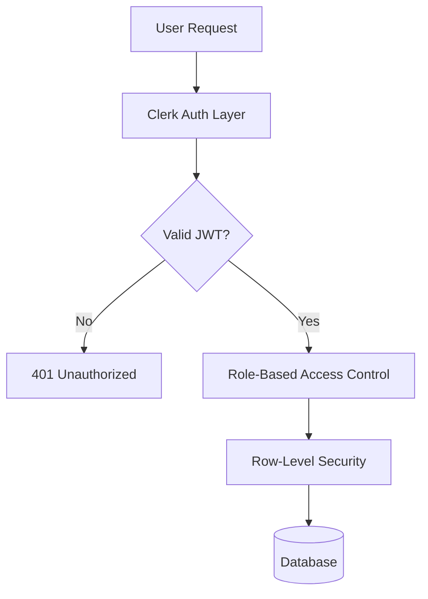
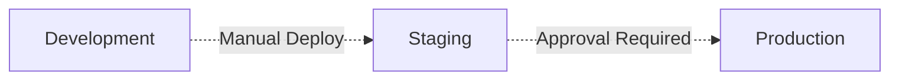

# Security Policy

**Coffee Advisory OS** is an enterprise-grade distribution intelligence platform handling sensitive financial data, client information, and proprietary business logic. We take security seriously and maintain institutional-grade security practices.

---

## 🛡️ Security Commitment

We are committed to:
- **Proactive Security** – Regular audits and threat modeling
- **Rapid Response** – 24-hour acknowledgment of critical vulnerabilities
- **Transparent Communication** – Timely disclosure after patches
- **Continuous Improvement** – Security-first development culture

---

## 🚨 Reporting a Vulnerability

### DO NOT Open Public Issues

Security vulnerabilities should **NEVER** be disclosed publicly until patched.

### Reporting Process

**Email:** security@unykorn.org

**Include:**
1. **Vulnerability Type** (e.g., SQL injection, XSS, authentication bypass)
2. **Affected Component** (agent, API route, database, etc.)
3. **Steps to Reproduce** (detailed, with proof of concept if possible)
4. **Potential Impact** (data exposure, privilege escalation, DOS, etc.)
5. **Suggested Fix** (optional, but appreciated)
6. **Your Contact Information** (for follow-up questions)

### What to Expect

| Timeline | Action |
|:---------|:-------|
| **0-24 hours** | Acknowledgment of report |
| **1-3 days** | Initial assessment and severity classification |
| **3-7 days** | Patch development (critical issues prioritized) |
| **7-14 days** | Patch deployment and coordinated disclosure |
| **14-30 days** | Public disclosure (if applicable) |

### Severity Classification

We use CVSS 3.1 scoring:

| Severity | CVSS Score | Response Time | Example |
|:---------|:-----------|:--------------|:--------|
| 🔴 **Critical** | 9.0-10.0 | < 24 hours | Remote code execution, full database access |
| 🟠 **High** | 7.0-8.9 | < 72 hours | SQL injection, authentication bypass |
| 🟡 **Medium** | 4.0-6.9 | < 7 days | XSS, CSRF, privilege escalation |
| 🟢 **Low** | 0.1-3.9 | < 30 days | Information disclosure, rate limit bypass |

---

## 🔒 Security Architecture

### Authentication & Authorization



**Implementation:**
- Clerk.com for authentication (MFA support)
- JWT tokens with short expiration (1 hour)
- Role-based access control (RBAC)
- Row-level security (RLS) in PostgreSQL
- API key rotation every 90 days

### Data Encryption

| Data State | Method | Standard |
|:-----------|:-------|:---------|
| **In Transit** | TLS 1.3 | HTTPS only, HSTS enabled |
| **At Rest** | AES-256 | Database-level encryption |
| **Backups** | AES-256 | Encrypted before storage |
| **Credentials** | HashiCorp Vault | Secrets never in code |

### Database Security

**PostgreSQL Hardening:**
- Principle of least privilege (application user with minimal permissions)
- Parameterized queries only (no string concatenation)
- Connection pooling with SSL enforcement
- Prepared statements for all queries
- Regular security patches

**Row-Level Security Example:**
```sql
CREATE POLICY client_isolation ON clients
  USING (organization_id = current_setting('app.current_org')::uuid);
```

### Agent System Security

**Audit Logging:**
Every agent action logs:
- User ID and role
- Action type and timestamp
- Input parameters (sanitized)
- Retrieved RAG sources
- Decision logic applied
- Output generated
- IP address and user agent

**Retention:** 7 years for financial compliance

**Validation:**
- Input sanitization before RAG indexing
- Output validation before database writes
- Rate limiting on agent invocations
- Approval workflows for high-value actions

### API Security

**Protection Mechanisms:**
- Rate limiting (100 requests/minute per IP)
- IP whitelisting for administrative endpoints
- CORS policy (strict origin validation)
- Request size limits (10 MB max)
- Automatic request logging
- DDoS protection via Vercel Edge Network

**Example Rate Limiting:**
```typescript
// Middleware in Next.js API routes
import { rateLimit } from '@/lib/rate-limit';

export default rateLimit({
  interval: 60 * 1000, // 1 minute
  uniqueTokenPerInterval: 500,
  maxRequests: 100
})(handler);
```

---

## 🧪 Security Testing

### Automated Scanning

**CI/CD Pipeline:**
- `npm audit` on every commit (dependency vulnerabilities)
- Snyk integration (open source security monitoring)
- ESLint security rules (code patterns)
- TypeScript strict mode (type safety)

### Manual Testing

**Quarterly Security Audits:**
- Penetration testing
- Code review of authentication logic
- RAG prompt injection testing
- SQL injection attempts
- XSS vulnerability scanning
- CSRF token validation

### Third-Party Audits

Annual security assessment by independent firm (planned for Q3 2025).

---

## 🔐 Dependency Management

### Vulnerability Scanning

Dependencies are continuously monitored via:
- GitHub Dependabot alerts
- Snyk vulnerability database
- npm audit reports

### Update Policy

| Severity | Action | Timeline |
|:---------|:-------|:---------|
| Critical | Immediate patch | < 24 hours |
| High | Urgent update | < 72 hours |
| Medium | Scheduled update | Next sprint |
| Low | Routine update | Monthly |

### Dependency Approval

New dependencies require:
- Security review
- License compatibility check
- Active maintenance verification (commits in last 90 days)
- Community trust score (npm downloads, GitHub stars)

---

## 🚀 Deployment Security

### Environment Isolation



**Separation:**
- Development (local, no real data)
- Staging (Vercel preview, anonymized data)
- Production (Vercel prod, full encryption)

### Secrets Management

**Never in Code:**
- API keys
- Database credentials
- Encryption keys
- OAuth secrets
- Webhook signatures

**Storage:**
- Vercel environment variables (production)
- `.env.local` (development, gitignored)
- HashiCorp Vault (future: enterprise scale)

### Infrastructure Security

**Vercel Platform:**
- Automatic TLS/SSL certificates
- DDoS protection
- Edge network isolation
- Automatic security headers
- WAF (Web Application Firewall)

**Database:**
- Private networking (no public access)
- Connection pooling with SSL
- Automatic backups (daily, encrypted)
- Point-in-time recovery (⁠35 days)

### Monitoring & Alerting

**Real-Time Monitoring:**
- Failed authentication attempts (>5 in 10 minutes)
- Unusual API usage patterns
- Database query anomalies
- High error rates (>5% of requests)
- Slow response times (>2s average)

**Alert Channels:**
- PagerDuty for critical issues
- Slack for warnings
- Email digest for daily summary

---

## 🔍 Compliance & Standards

### Frameworks

We align with:
- **OWASP Top 10** – Web application security risks
- **CWE Top 25** – Software weaknesses
- **NIST Cybersecurity Framework** – Risk management
- **SOC 2 Type II** (planned for 2026)

### Data Protection

**Privacy by Design:**
- Data minimization (collect only what's necessary)
- Purpose limitation (use only for stated purpose)
- Storage limitation (retention policies enforced)
- Right to access (client data export available)
- Right to deletion (GDPR compliance)

**PII Handling:**
- Client names, emails, phone numbers encrypted
- Credit scores treated as financial data
- Proposal content considered proprietary
- Log sanitization (no PII in logs)

### Financial Compliance

As a system handling payment terms and credit decisions:
- Audit trail for all financial actions
- 7-year data retention for invoices/proposals
- Compliance checks before proposal send
- Approval workflows for high-value deals (>$10K)

---

## 🛠 Incident Response Plan

### Phase 1: Detection & Assessment (0-1 hour)

1. **Alert Received** (automated monitoring or user report)
2. **Severity Classification** (critical/high/medium/low)
3. **Incident Commander Assigned**
4. **War Room Created** (Slack channel)
5. **Initial Impact Assessment**

### Phase 2: Containment (1-4 hours)

1. **Isolate Affected Systems** (if applicable)
2. **Revoke Compromised Credentials**
3. **Block Malicious IPs** (if attack in progress)
4. **Preserve Evidence** (logs, database snapshots)
5. **Communicate to Stakeholders**

### Phase 3: Eradication (4-24 hours)

1. **Root Cause Analysis**
2. **Patch Development & Testing**
3. **Vulnerability Remediation**
4. **Security Control Enhancement**

### Phase 4: Recovery (24-72 hours)

1. **Deploy Fixes to Production**
2. **Monitor for Recurrence**
3. **Data Integrity Validation**
4. **Service Restoration**
5. **User Communication**

### Phase 5: Lessons Learned (72+ hours)

1. **Post-Mortem Document**
2. **Process Improvements**
3. **Security Training Updates**
4. **Public Disclosure** (if applicable)

---

## 📋 Security Checklist (Development)

Before deploying new features:

- [ ] Input validation on all user inputs
- [ ] Output encoding to prevent XSS
- [ ] Parameterized SQL queries (no string concatenation)
- [ ] Authentication required for sensitive endpoints
- [ ] Authorization checks (role-based access control)
- [ ] Rate limiting on public endpoints
- [ ] Audit logging for financial actions
- [ ] Error messages don't leak system information
- [ ] Secrets in environment variables, not code
- [ ] Dependencies updated and scanned
- [ ] HTTPS enforced (no mixed content)
- [ ] CORS policy configured correctly
- [ ] Security headers set (CSP, HSTS, X-Frame-Options)
- [ ] RAG content sanitized before indexing
- [ ] Agent outputs validated before execution

---

## 🏆 Security Hall of Fame

We recognize security researchers who responsibly disclose vulnerabilities:

### 2025 Contributors

*(To be updated as researchers contribute)*

**Rewards:**
- Public acknowledgment (with permission)
- Coffee Advisory OS swag
- Finder's fee (case-by-case basis for critical findings)

---

## 📞 Security Contact

**Primary Contact:** security@unykorn.org

**PGP Key:** [Link to public key] *(coming soon)*

**Response Time:**
- Critical issues: < 24 hours
- High issues: < 72 hours
- All other issues: < 7 days

---

## 📜 Version History

| Version | Date | Changes |
|:--------|:-----|:--------|
| 1.0 | 2025-02-25 | Initial security policy |

---

## 🔗 Additional Resources

- [OWASP Top 10](https://owasp.org/www-project-top-ten/)
- [NIST Cybersecurity Framework](https://www.nist.gov/cyberframework)
- [Clerk Security Practices](https://clerk.com/docs/security)
- [Vercel Security](https://vercel.com/docs/security)
- [PostgreSQL Security](https://www.postgresql.org/docs/current/security.html)

---

**Security is everyone's responsibility.**

If you see something, say something.

☕🔒
