# Agent Map & Intelligence Architecture

This document provides a comprehensive visualization and explanation of the Coffee Advisory OS agent system, MCP orchestration layer, and intelligence flows.

---

## 🧠 Agent System Overview

The Coffee Advisory OS uses a **Model Context Protocol (MCP)** orchestration layer to coordinate five specialized autonomous agents. Each agent has a distinct domain of responsibility, shared context access via RAG, and unified logging.

---

## 🗺️ Complete System Architecture


---

## 🤖 Agent Detailed Breakdown

### 1. Proposal Agent

**Primary Responsibility:** AI-powered custom proposal generation with RAG-enhanced context.


**Key Functions:**

| Function | Purpose | Inputs | Outputs |
|:---------|:--------|:-------|:--------|
| `generateProposal()` | Full proposal workflow | clientId, volumeTier, roastProfile, paymentTerms | Proposal object with PDF URL |
| `regenerateProposal()` | Create versioned updates | proposalId, changes | New version proposal |
| `getProposalMetrics()` | Engagement analytics | proposalId | Time-to-view, time-to-respond |
| `analyzeConversionRates()` | Performance analysis | dateRange, filters | Conversion % by tier/terms |
| `getProposalsNeedingFollowUp()` | Stale proposal identification | daysThreshold | List of proposals |

**RAG Integration:**

```typescript
// Retrieve similar historical proposals
const similarProposals = await ragService.retrieveRelevant(
  `Coffee proposal for ${client.businessName}, volume ${volumeTier}, credit score ${creditScore}`,
  5 // top 5 matches
);

// Use context in GPT-4 prompt
const prompt = `
Generate a personalized coffee supply proposal for ${client.businessName}.

Context from similar successful proposals:
${similarProposals.map(p => p.content).join('\n\n')}

Client profile: ${JSON.stringify(client)}
Requirements: ${JSON.stringify(params)}
`;
```

**Pricing Logic:**

```typescript
// Volume-based pricing
const basePricing = {
  low: { basePrice: 8.50, margin: 0.26 }, // <200 lbs/month
  mid: { basePrice: 8.00, margin: 0.27 }, // 200-500 lbs/month
  high: { basePrice: 9.00, margin: 0.39 } // >500 lbs/month
};

// Credit-based discount
if (creditScore >= 80) {
  pricing.discount += 0.02; // 2% off for excellent credit
}

// Volume commitment bonus
if (monthlyVolume >= 500) {
  pricing.discount += 0.03; // 3% off for high volume
}

// Calculate final price
const finalPrice = basePrice * (1 - totalDiscount);
```

---

### 2. Credit Risk Agent

**Primary Responsibility:** Financial risk assessment and payment term structuring.


**Scoring Algorithm:**

| Factor | Weight | Scoring Logic |
|:-------|:-------|:--------------|
| Years in Business | 20 pts | 0-1 yr: 0 pts<br/>2-3 yrs: 10 pts<br/>4-5 yrs: 15 pts<br/>6+ yrs: 20 pts |
| Monthly Revenue | 25 pts | <$10K: 0 pts<br/>$10K-$25K: 10 pts<br/>$25K-$50K: 18 pts<br/>$50K+: 25 pts |
| D&B Score | 30 pts | Linear mapping<br/>1-100 → 0-30 pts |
| Trade References | 15 pts | 3 pts per reference<br/>Max 5 references |
| Payment History | 20 pts | Perfect: 20 pts<br/>1-2 late: 10 pts<br/>3+ late: 0 pts |

**Key Functions:**

| Function | Purpose | Business Logic |
|:---------|:--------|:---------------|
| `scoreClient()` | Calculate credit score | 5-factor weighted algorithm |
| `getHighRiskClients()` | Identify problem accounts | Score < 65 |
| `monitorOverdueInvoices()` | Aging analysis | 30/60/90 day buckets |
| `flagRiskAccounts()` | Auto-downgrade terms | 2+ late payments → prepay |

---

### 3. Supplier Origin Agent

**Primary Responsibility:** Regenerative sourcing tracking and sustainability certification.

```mermaid
flowchart TD
    Start[Certificate Request] --> Fetch[Fetch Origin Data]
    Fetch --> Farm[Farm Details]
    Fetch --> Practices[Regen Practices]
    Fetch --> Metrics[Impact Metrics]
    
    Farm --> Generate[Generate Certificate]
    Practices --> Generate
    Metrics --> Generate
    
    Generate --> Carbon[Carbon Sequestration<br/>tons CO₂/ha/year]
    Generate --> Bio[Biodiversity Score<br/>Species + habitat]
    Generate --> Water[Water Conservation<br/>% reduction]
    Generate --> Soil[Soil Health<br/>Organic matter + microbes]
    
    Carbon --> PDF[Create PDF Certificate]
    Bio --> PDF
    Water --> PDF
    Soil --> PDF
    
    PDF --> Client[Deliver to Client]
    Client --> Marketing[Client Uses in Marketing]
```



**Impact Metrics:**

```typescript
interface RegenerativeImpact {
  carbonSequestration: number; // tons CO₂/hectare/year
  biodiversityScore: number; // 0-100 scale
  waterConservation: number; // % reduction vs conventional
  soilHealthIndex: number; // organic matter + microbial activity
  farmSize: number; // hectares
  certifications: string[]; // e.g., ['Rainforest Alliance', 'Fair Trade']
}
```

**Key Functions:**

| Function | Purpose | Outputs |
|:---------|:--------|:--------|
| `generateCertificate()` | Create sustainability cert | PDF with impact metrics |
| `getRegenerativeOrigins()` | Filter available lots | List of regen-certified origins |
| `calculateTotalImpact()` | Aggregate client's impact | Total carbon offset, water saved |
| `monitorLowStock()` | Inventory alerts | Origins below threshold |

---

### 4. Outreach Agent

**Primary Responsibility:** AI-drafted emails and automated follow-up scheduling.


**Email Types:**

| Type | Purpose | Trigger | Tone |
|:-----|:--------|:--------|:-----|
| `initial` | First contact after lead capture | Manual/auto after credit scoring | Professional, informative |
| `follow_up` | Check-in on sent proposal | 7 days after proposal sent | Friendly, non-pushy |
| `proposal` | Deliver custom offer | After proposal generation | Formal, detailed |
| `reorder` | Remind about repeat purchase | 30 days before predicted reorder | Casual, relationship-building |

**Key Functions:**

| Function | Purpose | AI Enhancement |
|:---------|:--------|:---------------|
| `draftEmail()` | Generate personalized email | GPT-4 with RAG context |
| `scheduleFollowUp()` | Set future reminder | Predictive timing based on history |
| `getFollowUpsForToday()` | Daily task list | Priority sorting |
| `trackResponse()` | Update last contact date | Engagement analytics |

**Personalization Logic:**

```typescript
const emailContext = {
  clientName: client.businessName,
  lastInteraction: client.lastContactDate,
  proposalStatus: proposal.status,
  creditTier: client.creditTier,
  previousOrders: await getOrderHistory(client.id),
  roastPreference: client.preferredRoast,
  volumeTier: client.volumeTier
};

const prompt = `
Draft a ${purpose} email to ${clientName}.

Context:
- Last interaction: ${lastInteraction}
- Current stage: ${proposalStatus}
- Tone: ${getToneForPurpose(purpose)}

Personalization points:
${JSON.stringify(emailContext, null, 2)}

Style guide:
- Keep under 150 words
- Focus on value, not features
- Include clear call-to-action
- Maintain warm but professional tone
`;
```

---

### 5. Compliance Agent

**Primary Responsibility:** Proposal compliance verification and audit trail maintenance.

```mermaid
flowchart TD
    Start[Verify Proposal] --> Terms[Check Payment Terms]
    Start --> Pricing[Check Pricing Margins]
    Start --> Fields[Verify Required Fields]
    Start --> Value[Check Deal Value]
    
    Terms --> TermLogic{Terms Match Credit?}
    TermLogic -->|Yes| Pass1[✓ Pass]
    TermLogic -->|No| Fail1[✗ Fail:<br/>Terms too generous]
    
    Pricing --> PriceLogic{Margin ≥ 15%?}
    PriceLogic -->|Yes| Pass2[✓ Pass]
    PriceLogic -->|No| Fail2[✗ Fail:<br/>Margin too low]
    
    Fields --> FieldLogic{All Required Present?}
    FieldLogic -->|Yes| Pass3[✓ Pass]
    FieldLogic -->|No| Fail3[✗ Fail:<br/>Missing data]
    
    Value --> ValueLogic{> $10K threshold?}
    ValueLogic -->|Yes| Approval[⚠ Manual Approval<br/>Required]
    ValueLogic -->|No| Pass4[✓ Auto-approve]
    
    Pass1 --> Aggregate
    Pass2 --> Aggregate
    Pass3 --> Aggregate
    Pass4 --> Aggregate
    Fail1 --> Aggregate
    Fail2 --> Aggregate
    Fail3 --> Aggregate
    Approval --> Aggregate
    
    Aggregate[Aggregate Results] --> Log[Log to Audit Trail]
    Log --> Return[Return Compliance Status]
```



**Compliance Checks:**

| Check | Rule | Enforcement |
|:------|:-----|:------------|
| Payment Terms Alignment | Score 80+: allow net-30<br/>Score 65-79: max net-15<br/>Score <65: prepay only | HARD enforcement |
| Pricing Margin Floor | Minimum 15% gross margin | HARD enforcement |
| Required Fields | Client, terms, pricing, products | HARD enforcement |
| High-Value Approval | Deals >$10K require manager sign-off | SOFT enforcement (flag) |
| Legal Language | Proposal includes T&Cs | SOFT enforcement (warning) |

**Key Functions:**

| Function | Purpose | Returns |
|:---------|:--------|:--------|
| `verifyProposal()` | Run all compliance checks | Pass/fail + reasons |
| `checkPaymentTerms()` | Validate terms vs credit score | Boolean + recommendation |
| `getAuditTrail()` | Retrieve full history | Chronological log |
| `getComplianceSummary()` | 30-day metrics | Pass rate, common failures |

---

## 🧭 MCP Orchestration Layer

### Tool Registry

The MCP server exposes 7 tools that external systems can invoke:

```typescript
const tools = [
  {
    name: 'generate_proposal',
    description: 'Generate AI-tailored coffee supply proposal',
    inputSchema: {
      clientId: 'string',
      volumeTier: 'low | mid | high',
      roastProfile: 'string',
      paymentTerms: 'prepay | net-15 | net-30'
    }
  },
  {
    name: 'score_credit',
    description: 'Calculate client credit score and recommend terms',
    inputSchema: { clientId: 'string' }
  },
  {
    name: 'get_regenerative_certificate',
    description: 'Generate sustainability certificate for origin',
    inputSchema: { originId: 'string', volume: 'number' }
  },
  {
    name: 'draft_outreach_email',
    description: 'AI-drafted personalized email',
    inputSchema: {
      clientId: 'string',
      purpose: 'initial | follow_up | proposal | reorder'
    }
  },
  {
    name: 'schedule_follow_up',
    description: 'Set automated follow-up reminder',
    inputSchema: {
      clientId: 'string',
      days: 'number',
      message: 'string'
    }
  },
  {
    name: 'verify_proposal_compliance',
    description: 'Check proposal meets all requirements',
    inputSchema: { proposalId: 'string' }
  },
  {
    name: 'get_dashboard_metrics',
    description: 'Retrieve real-time business analytics',
    inputSchema: { dateRange: 'string' }
  }
];
```

### Communication Flow


---

## 🧠 RAG Intelligence Layer

### Document Indexing Pipeline


### Semantic Search Flow


### Vector Storage Schema

```sql
CREATE TABLE documents (
  id SERIAL PRIMARY KEY,
  content TEXT NOT NULL,
  embedding VECTOR(1536),
  metadata JSONB,
  created_at TIMESTAMPTZ DEFAULT NOW()
);

CREATE INDEX ON documents 
USING ivfflat (embedding vector_cosine_ops)
WITH (lists = 100);
```

### RAG Query Example

```typescript
// Retrieve context for proposal generation
const context = await ragQuery(
  `Generate coffee proposal for ${client.businessName}, 
   volume tier ${volumeTier}, 
   credit score ${creditScore}`,
  5 // top 5 most relevant docs
);

// Returns documents like:
[
  {
    content: "Previous proposal for similar cafe...",
    similarity: 0.89,
    metadata: { type: 'proposal', clientType: 'cafe', volumeTier: 'mid' }
  },
  {
    content: "Successful pricing strategy for medium volume...",
    similarity: 0.84,
    metadata: { type: 'pricing', margin: 0.27 }
  },
  // ...
]
```

---

## 📊 Agent Interaction Patterns

### Pattern 1: Sequential Chain

Proposal generation involves multiple agents in sequence:


### Pattern 2: Parallel Execution

Dashboard metrics aggregate from multiple agents simultaneously:


### Pattern 3: Event-Driven Triggers

Certain events automatically trigger agent actions:


---

## 🔍 Agent Logging & Observability

Every agent action creates a structured log entry:

```typescript
interface AgentLog {
  id: number;
  agentName: string; // 'ProposalAgent', 'CreditAgent', etc.
  action: string; // 'generate_proposal', 'score_client', etc.
  userId: string;
  input: Record<string, any>; // Parameters passed to agent
  output: Record<string, any>; // Result returned by agent
  context: Record<string, any>; // RAG sources, intermediate data
  success: boolean;
  errorMessage: string | null;
  executionTime: number; // milliseconds
  timestamp: Date;
}
```

**Example Log Entry:**

```json
{
  "agentName": "ProposalAgent",
  "action": "generate_proposal",
  "userId": "user_abc123",
  "input": {
    "clientId": "shop-123",
    "volumeTier": "mid",
    "roastProfile": "medium"
  },
  "output": {
    "proposalId": "prop-789",
    "pdfUrl": "/proposals/prop-789.pdf",
    "margin": 0.27
  },
  "context": {
    "ragSources": ["prop-456", "prop-234"],
    "creditScore": 82,
    "similarProposalsFound": 5
  },
  "success": true,
  "executionTime": 1247,
  "timestamp": "2025-02-25T10:30:15Z"
}
```

---

## 🧪 Testing Agent Behavior

### Unit Testing (Single Agent)

```typescript
describe('CreditAgent', () => {
  it('should assign net-30 terms for score 80+', async () => {
    const result = await creditAgent.scoreClient('client-high-score');
    expect(result.score).toBeGreaterThanOrEqual(80);
    expect(result.paymentTerms).toBe('net-30');
  });
});
```

### Integration Testing (Multiple Agents)

```typescript
describe('Proposal Generation Flow', () => {
  it('should generate compliant proposal end-to-end', async () => {
    // Score credit
    const creditResult = await creditAgent.scoreClient(clientId);
    
    // Generate proposal
    const proposal = await proposalAgent.generate({
      clientId,
      paymentTerms: creditResult.paymentTerms
    });
    
    // Verify compliance
    const compliance = await complianceAgent.verifyProposal(proposal.id);
    
    expect(compliance.passed).toBe(true);
  });
});
```

---

## 🚀 Future Agent Enhancements

### Phase 2 Agents (Planned)

| Agent | Purpose | Status |
|:------|:--------|:-------|
| **Forecasting Agent** | ML-based inventory prediction | Q2 2025 |
| **Negotiation Agent** | AI price negotiation within guardrails | Q3 2025 |
| **Churn Prediction Agent** | Identify at-risk clients | Q3 2025 |
| **Supply Chain Agent** | Multi-warehouse optimization | Q4 2025 |

### Advanced Capabilities

- **Multi-modal RAG**: Image + text embeddings (coffee bag photos, farm imagery)
- **Voice Agents**: Conversational interfaces for sales calls
- **Reinforcement Learning**: Agents learn from proposal success/failure
- **Cross-Agent Learning**: Shared memory pool for pattern recognition

---

## 📞 Agent Development Resources

- [MCP SDK Documentation](https://modelcontextprotocol.io/docs)
- [OpenAI Embeddings Guide](https://platform.openai.com/docs/guides/embeddings)
- [pgvector Documentation](https://github.com/pgvector/pgvector)
- [Agent Architecture Patterns](./architecture.md)

---

**The future of distribution is autonomous.**

Coffee Advisory OS agents work 24/7 so distribution teams can focus on relationships, not repetitive tasks.

☕🤖
