# Coffee Advisory OS Branding Guide

This document defines the visual identity, tone of voice, and presentation standards for the Coffee Advisory OS platform. Use this guide to maintain consistency across all customer-facing and internal materials.

---

## 🎨 Brand Identity

### Positioning Statement

**Coffee Advisory OS is not a coffee CRM.**

It's a **distribution intelligence layer** that happens to sell beans. We position ourselves at the intersection of:
- Boutique distribution expertise
- Enterprise-grade technology
- AI-native intelligence
- Regenerative agriculture advocacy

---

## 🌈 Color System

### Primary Palette (Coffee-Inspired)

```css
/* Core Brand Colors */
--coffee-dark: #3E2723;      /* Rich espresso */
--coffee-medium: #6D4C41;    /* Medium roast */
--coffee-light: #A1887F;     /* Light roast */
--cream: #EFEBE9;            /* Cream tone */
```



```mermaid
graph LR
    A["🟤 Coffee Dark<br/>#3E2723"] 
    B["🟫 Coffee Medium<br/>#6D4C41"]
    C["🤎 Coffee Light<br/>#A1887F"]
    D["🟨 Cream<br/>#EFEBE9"]
```

### Functional Colors (System Intelligence Layers)

| Color | Hex | Purpose | Layer |
|:------|:----|:--------|:------|
| 🟦 Blue | `#2196F3` | Client interface, dashboard | Interface |
| 🟩 Green | `#4CAF50` | Revenue, proposals, growth | Revenue Engine |
| 🟨 Yellow | `#FFC107` | Credit risk, warnings | Risk Management |
| 🟥 Red | `#F44336` | Governance, alerts, critical | Compliance |
| 🟪 Purple | `#9C27B0` | Intelligence, AI, RAG | AI/ML Layer |
| ⚫ Black | `#212121` | Infrastructure, backend | Technical |

### Usage Guidelines

**Dashboard & UI:**
```css
/* Background hierarchy */
--bg-primary: #FFFFFF;       /* Main content */
--bg-secondary: #EFEBE9;     /* Cream - sections */
--bg-tertiary: #A1887F;      /* Coffee light - hover states */

/* Text hierarchy */
--text-primary: #3E2723;     /* Coffee dark - body text */
--text-secondary: #6D4C41;   /* Coffee medium - labels */
--text-tertiary: #A1887F;    /* Coffee light - muted */

/* Brand accent */
--accent: #9C27B0;           /* Purple - CTAs, highlights */
```

**Proposal PDFs:**
```css
/* Professional & clean */
--header-bg: #3E2723;        /* Dark espresso */
--header-text: #EFEBE9;      /* Cream */
--body-text: #212121;        /* Near black */
--accent: #4CAF50;           /* Green for pricing */
```

---

## 📝 Typography

### Font Stack

**Primary (Interface & Documentation):**
```css
font-family: 'Inter', -apple-system, BlinkMacSystemFont, 'Segoe UI', system-ui, sans-serif;
```

**Secondary (Headings & Emphasis):**
```css
font-family: 'Poppins', 'Inter', sans-serif;
```

**Monospace (Code & Data):**
```css
font-family: 'JetBrains Mono', 'Fira Code', 'Consolas', monospace;
```

### Type Scale

| Element | Size | Weight | Line Height | Usage |
|:--------|:-----|:-------|:------------|:------|
| H1 | 32px | 700 Bold | 1.2 | Page titles |
| H2 | 24px | 600 SemiBold | 1.3 | Section headers |
| H3 | 20px | 600 SemiBold | 1.4 | Subsections |
| H4 | 18px | 500 Medium | 1.4 | Card titles |
| Body | 16px | 400 Regular | 1.6 | Main content |
| Small | 14px | 400 Regular | 1.5 | Labels, metadata |
| Caption | 12px | 400 Regular | 1.4 | Timestamps, hints |
| Code | 14px | 400 Regular | 1.5 | Inline code |

---

## 🏛 Visual Design Principles

### 1. Enterprise-Grade Polish

**Guidance:** Every UI element should feel intentional, not accidental.

✅ **DO:**
- Clean lines and generous whitespace
- Subtle shadows for depth (0-4px)
- Consistent border radius (4px for cards, 2px for inputs)
- Professional color contrast (WCAG AA minimum)

❌ **DON'T:**
- Overly bright neon colors
- Comic Sans or playful fonts
- Animated GIFs (use subtle transitions)
- Clutter or information overload

### 2. Institutional Credibility

**Guidance:** Design should convey "this is built like a bank, not a startup MVP."

✅ **DO:**
- Data-rich dashboards with charts
- Precise numerical displays (2 decimal places for money)
- Audit timestamps on all records
- Professional table layouts

❌ **DON'T:**
- Cartoonish icons
- Empty states with humor
- Informal language in error messages
- Trendy design fads

### 3. AI-Native Intelligence

**Guidance:** Make AI capabilities visible but not gimmicky.

✅ **DO:**
- Subtle purple accents for AI-generated content
- "Powered by AI" badges on proposals
- RAG source attribution ("Based on 5 similar proposals")
- Confidence indicators for predictions

❌ **DON'T:**
- Overuse of "AI" buzzword
- Fake loading spinners
- Anthropomorphizing agents ("Bob the Bot")
- Hiding how AI works (transparency is key)

---

## 📄 PDF Proposal Design

### Layout Structure

```
┌─────────────────────────────────────────┐
│ HEADER (Coffee Dark #3E2723)           │
│ Logo + "Coffee Supply Proposal"         │
└─────────────────────────────────────────┘

┌─────────────────────────────────────────┐
│ CLIENT DETAILS (Cream background)       │
│ Business Name, Date, Terms              │
└─────────────────────────────────────────┘

┌─────────────────────────────────────────┐
│ PERSONALIZED MESSAGE                    │
│ AI-generated intro paragraph            │
└─────────────────────────────────────────┘

┌─────────────────────────────────────────┐
│ PRICING TABLE (Green accents)           │
│ Product | Volume | Price | Total        │
└─────────────────────────────────────────┘

┌─────────────────────────────────────────┐
│ ORIGIN STORY                            │
│ Regenerative sourcing details + map     │
└─────────────────────────────────────────┘

┌─────────────────────────────────────────┐
│ SUSTAINABILITY CERTIFICATE              │
│ Impact metrics + badges                 │
└─────────────────────────────────────────┘

┌─────────────────────────────────────────┐
│ TERMS & CONDITIONS                      │
│ Payment terms, delivery, legal          │
└─────────────────────────────────────────┘

┌─────────────────────────────────────────┐
│ FOOTER                                  │
│ Contact info + "Powered by Coffee OS"   │
└─────────────────────────────────────────┘
```

### Visual Elements

**Header:**
- Logo: 48x48px (SVG)
- Background: Coffee Dark (`#3E2723`)
- Text: Cream (`#EFEBE9`)
- Height: 80px

**Typography:**
- Headings: Poppins 18px SemiBold
- Body: Inter 12px Regular
- Tables: JetBrains Mono 11px (numbers)

**Branding:**
- Subtle watermark (10% opacity) in background
- "AI-Generated Proposal" badge in bottom corner
- QR code linking to web version

---

## 🖼️ Iconography

### Icon Set: Lucide React

We use [Lucide](https://lucide.dev/) for consistent, professional icons.

**Common Icons:**

| Concept | Icon | Usage |
|:--------|:-----|:------|
| Proposal | `FileText` | Proposals, documents |
| Credit Score | `TrendingUp` / `TrendingDown` | Risk indicators |
| Client | `Building2` | Business accounts |
| AI/Intelligence | `Brain` | AI-powered features |
| Regenerative | `Leaf` | Sustainability |
| Revenue | `DollarSign` | Financial metrics |
| Alert | `AlertTriangle` | Warnings |
| Success | `CheckCircle` | Completed actions |
| Agent | `Bot` | MCP agents |
| Dashboard | `LayoutDashboard` | Analytics |

### Icon Style

```tsx
import { FileText } from 'lucide-react';

<FileText 
  size={20}           // Consistent sizing (16/20/24/32)
  strokeWidth={2}     // Medium weight
  color="#3E2723"     // Coffee dark
  className="mr-2"    // Spacing utility
/>
```

---

## 💬 Tone of Voice

### Brand Personality

We are:
- **Professional** but not stuffy
- **Intelligent** but not condescending
- **Confident** but not arrogant
- **Innovative** but not gimmicky
- **Human** but not overly casual

### Copy Guidelines

#### ✅ DO Write Like This:

> **Dashboard Header:**
> "24 proposals awaiting response. Your follow-up game is strong."

> **Error Message:**
> "We couldn't process that credit score. Please verify the D&B number and try again."

> **Feature Description:**
> "Our AI analyzes 5 years of proposal data to craft offers that convert 71% better than industry average."

#### ❌ DON'T Write Like This:

> **Too Casual:**
> "Oopsie! Something broke. Try again later? 🙃"

> **Too Robotic:**
> "Error code 1847: Database connection failure. Contact system administrator."

> **Too Sales-y:**
> "REVOLUTIONIZE your coffee distribution with our GAME-CHANGING AI!!!"

### Voice by Context

| Context | Tone | Example |
|:--------|:-----|:--------|
| Marketing | Confident, benefit-driven | "From first contact to repeat order in 12 automated steps" |
| UI Labels | Clear, action-oriented | "Generate Proposal" (not "Create New Proposal Document") |
| Errors | Helpful, blame-free | "This payment term doesn't match the credit score. Try net-15 instead." |
| Success | Affirming, brief | "Proposal sent. Follow-up scheduled for March 3." |
| Documentation | Precise, educational | "The credit scoring algorithm uses 5 weighted factors totaling 110 points." |

---

## 📊 Data Visualization

### Chart Style

**Color Palette for Charts:**
```javascript
const chartColors = {
  primary: '#9C27B0',    // Purple - main data series
  secondary: '#4CAF50',  // Green - positive trends
  tertiary: '#FFC107',   // Yellow - warnings
  danger: '#F44336',     // Red - critical
  neutral: '#A1887F'     // Coffee light - historical data
};
```

### Chart Types by Use Case

| Data Type | Chart Type | Library |
|:----------|:-----------|:--------|
| Conversion rates over time | Line chart | Recharts |
| Credit risk distribution | Pie chart or bar | Tremor |
| Revenue by client tier | Stacked bar | Tremor |
| Proposal funnel | Funnel chart | Recharts |
| Geographic distribution | Map (Mapbox) | React Map GL |

### Design Principles

- **Axis labels:** 12px Inter Regular, Coffee Medium (`#6D4C41`)
- **Grid lines:** 1px, 10% opacity
- **Data points:** 6px circles
- **Tooltips:** Cream background, Coffee Dark text
- **Legends:** Bottom-aligned, horizontal

---

## 🖥️ Dashboard Components

### Card Design

```tsx
<div className="bg-white rounded-lg shadow-sm border border-gray-200 p-6">
  <div className="flex items-center justify-between mb-4">
    <h3 className="text-lg font-semibold text-coffee-dark">
      Active Clients
    </h3>
    <Building2 className="text-purple-600" size={24} />
  </div>
  
  <div className="text-3xl font-bold text-coffee-dark mb-2">
    47
  </div>
  
  <div className="text-sm text-coffee-medium">
    <TrendingUp size={16} className="inline mr-1 text-green-500" />
    +12% from last month
  </div>
</div>
```

### Table Design

```tsx
<table className="w-full">
  <thead className="bg-cream">
    <tr>
      <th className="text-left py-3 px-4 text-sm font-semibold text-coffee-dark">
        Client
      </th>
      <th className="text-left py-3 px-4 text-sm font-semibold text-coffee-dark">
        Credit Score
      </th>
      <th className="text-right py-3 px-4 text-sm font-semibold text-coffee-dark">
        Revenue
      </th>
    </tr>
  </thead>
  <tbody>
    <tr className="border-b border-gray-200 hover:bg-cream transition">
      <td className="py-3 px-4 text-sm text-coffee-dark">
        Artisan Coffee Co.
      </td>
      <td className="py-3 px-4">
        <span className="px-2 py-1 rounded text-xs font-medium bg-green-100 text-green-800">
          82 / Net-30
        </span>
      </td>
      <td className="py-3 px-4 text-right text-sm font-mono text-coffee-dark">
        $12,450.00
      </td>
    </tr>
  </tbody>
</table>
```

---

## 🏷️ Badge & Tag System

### Status Badges

```tsx
// Credit Risk Tiers
<span className="px-2 py-1 rounded text-xs font-medium bg-green-100 text-green-800">
  Low Risk
</span>

<span className="px-2 py-1 rounded text-xs font-medium bg-yellow-100 text-yellow-800">
  Medium Risk
</span>

<span className="px-2 py-1 rounded text-xs font-medium bg-red-100 text-red-800">
  High Risk
</span>

// Proposal Status
<span className="px-2 py-1 rounded text-xs font-medium bg-purple-100 text-purple-800">
  AI-Generated
</span>
```

---

## 📧 Email Templates

### Transactional Email Structure

**Subject Lines:**
- Clear and specific: "Your Coffee Supply Proposal - Artisan Coffee Co."
- No emojis or ALL CAPS
- Include client name for personalization

**Body Template:**

```html
<!DOCTYPE html>
<html>
<head>
  <style>
    body { font-family: Inter, sans-serif; color: #3E2723; }
    .header { background: #3E2723; color: #EFEBE9; padding: 20px; }
    .content { padding: 30px; background: #FFFFFF; }
    .cta { background: #9C27B0; color: white; padding: 12px 24px; border-radius: 4px; }
  </style>
</head>
<body>
  <div class="header">
    <h2>Coffee Supply Proposal</h2>
  </div>
  
  <div class="content">
    <p>Hi [Client Name],</p>
    
    <p>[AI-generated personalized message]</p>
    
    <a href="[proposal_url]" class="cta">View Your Proposal</a>
    
    <p>Questions? Reply to this email.</p>
    
    <p>—<br/>
    [Your Name]<br/>
    Powered by Coffee Advisory OS</p>
  </div>
</body>
</html>
```

---

## 🌐 Web Microsite (Proposal Pages)

### Design System

**Layout:**
- Max width: 800px (readable)
- Centered content
- Sticky header with logo
- Footer with contact info

**Sections:**
1. Hero: Client name + "Your Custom Proposal"
2. Personalized message
3. Pricing table (interactive)
4. Origin story with images
5. Sustainability certificate
6. CTA: "Accept Proposal" button
7. Terms & conditions (collapsible)

**Interactive Elements:**
- Volume slider (adjust pricing in real-time)
- Accept/Decline buttons (tracked)
- Download PDF button
- Share on social media (for regenerative story)

---

## 🎥 Motion & Animation

### Micro-Interactions

**Button Hover:**
```css
.button {
  transition: all 0.2s ease-in-out;
}

.button:hover {
  transform: translateY(-2px);
  box-shadow: 0 4px 8px rgba(0,0,0,0.15);
}
```

**Card Hover:**
```css
.card {
  transition: box-shadow 0.3s ease;
}

.card:hover {
  box-shadow: 0 8px 16px rgba(0,0,0,0.1);
}
```

**Page Transitions:**
- Fade in: 300ms
- Slide up: 400ms (for modals)
- No excessive animations (enterprise feel)

---

## 🧪 Brand Application Examples

### 1. Landing Page Hero

```tsx
<section className="bg-gradient-to-br from-coffee-dark to-coffee-medium text-cream">
  <div className="max-w-6xl mx-auto px-6 py-24">
    <h1 className="text-5xl font-bold mb-6">
      AI-Native Distribution Intelligence
    </h1>
    <p className="text-2xl mb-8 opacity-90">
      From warehouse to espresso machine in 12 automated steps.
    </p>
    <button className="bg-purple-600 hover:bg-purple-700 text-white px-8 py-4 rounded-lg text-lg font-semibold">
      Get Started
    </button>
  </div>
</section>
```

### 2. Proposal Card

```tsx
<div className="bg-white rounded-lg shadow-lg border-l-4 border-green-500 p-6">
  <div className="flex items-start justify-between mb-4">
    <div>
      <h3 className="text-lg font-semibold text-coffee-dark mb-1">
        Artisan Coffee Co. - Medium Roast Proposal
      </h3>
      <p className="text-sm text-coffee-medium">
        Sent Feb 20, 2025 • Net-30 Terms
      </p>
    </div>
    <span className="px-3 py-1 rounded-full text-xs font-medium bg-purple-100 text-purple-800">
      AI-Generated
    </span>
  </div>
  
  <div className="grid grid-cols-3 gap-4 mb-4">
    <div>
      <p className="text-xs text-coffee-medium mb-1">Volume</p>
      <p className="text-lg font-semibold text-coffee-dark">500 lbs</p>
    </div>
    <div>
      <p className="text-xs text-coffee-medium mb-1">Total Value</p>
      <p className="text-lg font-semibold text-green-600">$4,000</p>
    </div>
    <div>
      <p className="text-xs text-coffee-medium mb-1">Margin</p>
      <p className="text-lg font-semibold text-coffee-dark">27%</p>
    </div>
  </div>
  
  <div className="flex gap-2">
    <button className="flex-1 bg-purple-600 text-white py-2 rounded">
      View Proposal
    </button>
    <button className="px-4 border border-gray-300 text-coffee-dark rounded">
      <Share2 size={16} />
    </button>
  </div>
</div>
```

---

## 📖 Documentation Style

### Code Blocks

Use syntax highlighting with coffee-themed colors:

```typescript
// Clear, commented examples
export async function generateProposal(
  params: ProposalParams
): Promise<Proposal> {
  // 1. Validate inputs
  validateProposalParams(params);
  
  // 2. Retrieve RAG context
  const context = await ragService.retrieveRelevant(query);
  
  // 3. Generate with AI
  const proposal = await aiService.generate(params, context);
  
  return proposal;
}
```

### Mermaid Diagrams

Standardized colors:
- Purple (`#9C27B0`) for AI/intelligence
- Green (`#4CAF50`) for success paths
- Yellow (`#FFC107`) for warnings
- Red (`#F44336`) for errors
- Blue (`#2196F3`) for user actions

---

## 🎯 Brand Differentiation

### vs. Traditional Coffee CRMs

| Them | Us |
|:-----|:---|
| Generic SaaS look | Coffee-inspired, warm palette |
| "CRM" branding | "Intelligence Layer" positioning |
| Feature lists | Outcome-focused messaging |
| Stock photos | Custom diagrams & charts |
| Hidden complexity | Transparent AI attribution |

---

## 📝 Branding Checklist

Before launching any new feature or material:

- [ ] Uses approved color palette
- [ ] Typography follows scale
- [ ] Icons from Lucide set
- [ ] Tone of voice consistent
- [ ] Enterprise-grade polish
- [ ] AI attribution present (if applicable)
- [ ] Accessible (WCAG AA)
- [ ] Responsive design
- [ ] Loading states designed
- [ ] Error states helpful
- [ ] Success states affirming

---

## 🔗 Design Resources

- [Figma Design System](https://figma.com/@coffeeadvisoryos) *(coming soon)*
- [Brand Assets (SVG/PNG)](./assets/brand/) *(coming soon)*
- [Tailwind Config](../tailwind.config.ts)
- [Component Library](../app/components/)

---

**This is not a coffee CRM.**

**It's a distribution intelligence layer with intentional design.**

From color choices to copy, every element reinforces our positioning as **enterprise-grade infrastructure for boutique operations**.

☕🎨
